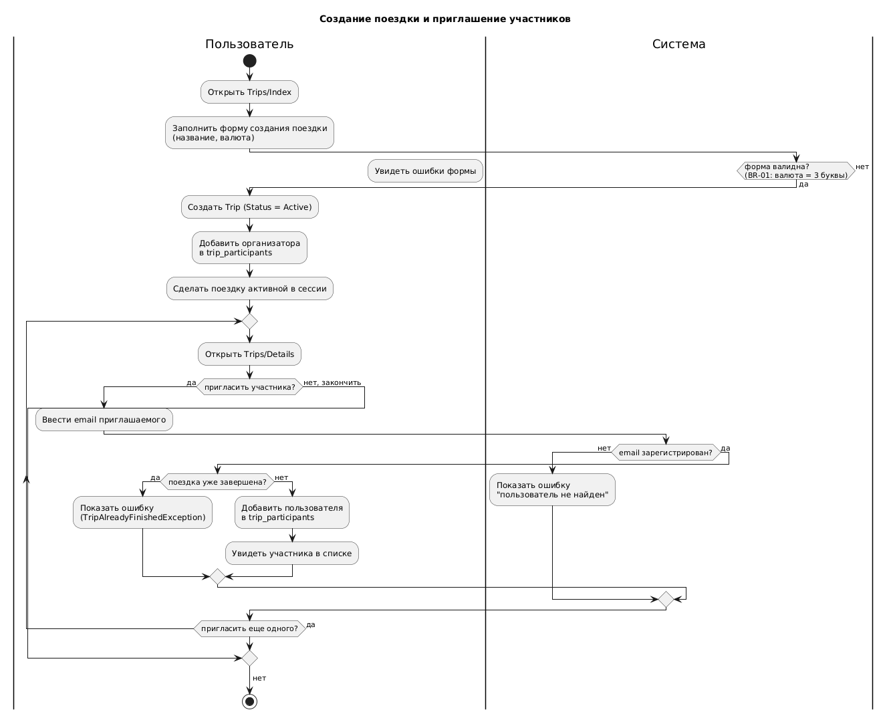
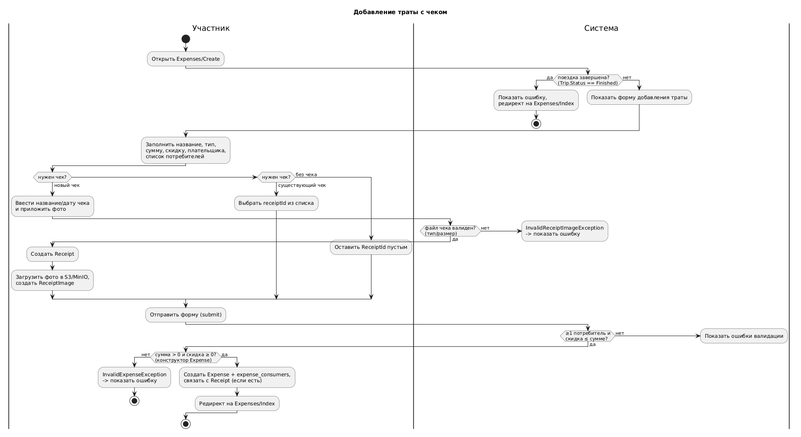
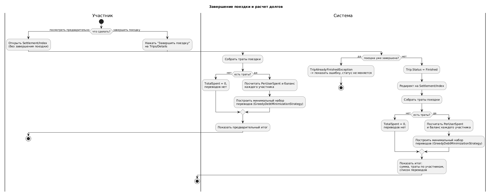
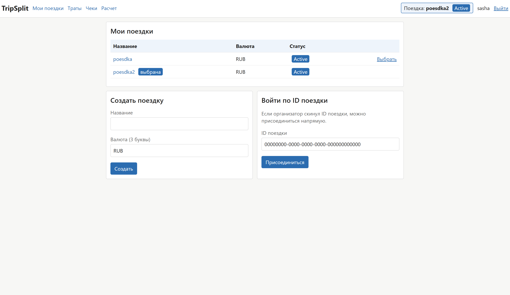
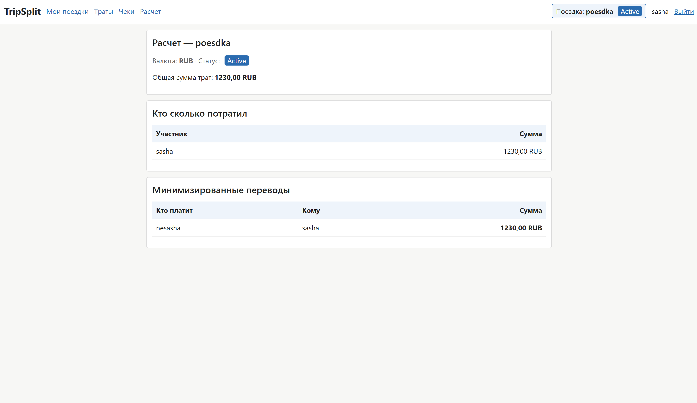

# TripSplit

## Цель и решаемая проблема

Во время поездок и совместных мероприятий люди часто оплачивают разные
покупки друг за друга (жилье, рестораны, такси), из-за чего накапливаются
сложные взаимные долги, которые трудно подсчитать вручную. TripSplit -
веб-приложение для совместного учета расходов в поездках: пользователи
создают поездку, добавляют участников, фиксируют траты (кто заплатил, за
что, на кого) с фотографиями чеков. По завершении поездки система сама
считает итоговые траты и формирует минимальное количество переводов между
участниками, закрывающее все долги.

## Функциональные требования

- **Аккаунт**: регистрация и вход по email (без пароля), выход из системы.
- **Поездки**: создание (название, валюта), присоединение по id поездки,
  приглашение участников по email, выбор активной поездки, просмотр списка
  и деталей поездки, завершение поездки.
- **Траты**: добавление (название, тип, сумма, скидка, плательщик,
  потребители), удаление, просмотр списка с итоговой суммой.
- **Чеки**: создание, загрузка/замена/удаление фото чека, привязка ранее не
  привязанных трат к чеку.
- **Расчет**: автоматический подсчет баланса каждого участника и
  минимального набора переводов, закрывающего все долги.

## Нефункциональные требования

- **Производительность**: время отклика ключевых страниц (список трат,
  расчет долгов) - p95 < 300 мс при ~10 запросов/сек на одном инстансе.
- **Надежность**: доступность ≥ 99% для однопроцессного развертывания; 0
  потерь подтвержденных данных при сбое (soft delete у поездок и трат,
  идемпотентная инициализация БД).
- **Безопасность**: все действия, привязанные к конкретной поездке, должны
  проверять, что пользователь - ее участник; сессия - `HttpOnly` cookie; все
  изменяющие запросы защищены CSRF-токеном. Известное ограничение на
  текущий момент: страница деталей поездки проверяет только факт входа в
  систему, но не членство в конкретной поездке.

## Use-case диаграмма

Два актора: Пользователь (не участвует в поездке сейчас) и Участник
(состоит в конкретной поездке).

## Бизнес-процессы (BPMN)

Обзорная сквозная схема жизненного цикла поездки:

Три нелинейных процесса с ветвлениями и обработкой ошибок:

## Пользовательские сценарии

**1. Создание поездки и приглашение участников.** Пользователь создает
поездку (название, валюта), становится первым участником, затем
приглашает других по email. Альтернатива: присоединиться самому по id
поездки. Ошибки: невалидная валюта - форма не отправляется; приглашение
незарегистрированного email - ошибка, участник не добавлен; попытка
изменить уже завершенную поездку - отклоняется. Результат: поездка и ее
участники сохранены.

**2. Добавление траты с чеком.** Участник указывает название, сумму,
скидку, плательщика и потребителей, опционально прикладывает чек (новый с
фото или существующий). Альтернатива: трата без чека или с привязкой к
чеку позже. Ошибки: поездка уже завершена; не выбран ни один потребитель;
скидка больше суммы; файл чека не проходит валидацию по типу/размеру.
Результат: трата (и при необходимости чек с изображением) сохранена, сумма
делится между потребителями поровну.

**3. Завершение поездки и расчет долгов.** По кнопке "завершить" поездка
получает статус "завершена", система считает баланс каждого участника
(оплачено минус потребленное) и строит минимальный набор переводов
(жадный алгоритм: наибольший должник платит наибольшему кредитору).
Альтернатива: предварительный просмотр расчета до завершения поездки.
Ошибка: повторное завершение отклоняется, статус не меняется. Результат:
поездка завершена, показан список переводов "кто кому сколько должен".

## ER-диаграмма сущностей

## Технологический стек

- **Backend**: C# / .NET 8, ASP.NET Core MVC.
- **Frontend**: Razor Views (серверный рендеринг HTML), обычный CSS, без
  JS-фреймворка.
- **База данных**: PostgreSQL; доступ - прямой SQL через Npgsql, без ORM.
- **Хранилище файлов**: S3-совместимое объектное хранилище (MinIO в
  dev-окружении) - для изображений чеков.
- **Доставка**: `dotnet publish`/`dotnet run` для запуска приложения;
  Docker Compose для вспомогательной инфраструктуры (сейчас - MinIO,
  целевое состояние - весь стенд, см. ADR-003 ниже).

## Схема базы данных (DBML)

## C4: контекст, контейнеры, компоненты

### Контекст системы

### Контейнеры

### Компоненты Web UI

### Компоненты Business Logic

### Компоненты Data Access

## Экраны

## Архитектурные решения (ADR)

**ADR-001: схема аутентификации.** Сейчас Web UI использует вход по email
без пароля; для будущего REST API нужна отдельная, обычно stateless
авторизация. Альтернативы: (A) email для UI + token-based (JWT) для API;
(B) полноценный Google OAuth вместо email-входа; (C) единый механизм
email/сессия для UI и API. Выбрано (A): не требует переделки работающего UI,
дает API правильную для REST модель, механизмы развиваются независимо.
Вариант B отклонен как избыточная работа без явной необходимости сейчас
(внешний провайдер, секреты); вариант C - как непригодный для внешних
клиентов API.

**ADR-002: хранение изображений чеков.** Чеки-фото могут достигать
нескольких мегабайт. Альтернативы: (A) S3-совместимое хранилище
(MinIO/S3); (B) BLOB (`bytea`) в PostgreSQL; (C) локальная файловая система
сервера. Выбрано (A): уже реализовано и покрыто тестами, не раздувает
бэкапы БД, масштабируется при нескольких инстансах приложения. Вариант B
отклонен из-за деградации производительности БД при росте числа чеков;
вариант C - из-за несовместимости с горизонтальным масштабированием.

**ADR-003: способ доставки приложения.** Сейчас `docker-compose.yml`
поднимает только MinIO, PostgreSQL и Web UI запускаются вручную.
Альтернативы: (A) полностью контейнеризованный docker-compose (Postgres +
MinIO + Web UI); (B) оставить текущее гибридное состояние; (C) переход на
Kubernetes. Выбрано (A) как целевое состояние: единая команда запуска всего
стенда, минимальные изменения в существующем коде (конфигурация уже
читается через переменные окружения). Вариант C отклонен как избыточный
для текущего масштаба проекта.

## Дополнительные материалы

Развернутые версии требований, сценариев, трассировки, карты экранов и
ADR, а также диаграммы, не входящие в обязательный минимум (sequence-
диаграммы, диаграммы классов компонентов): [docs/details.md](docs/details.md).
