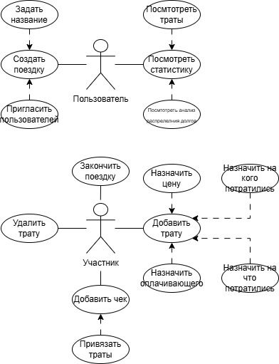
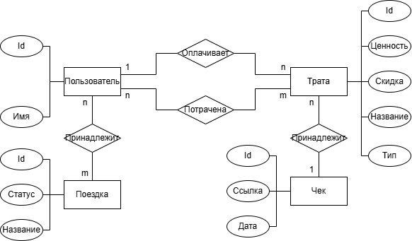
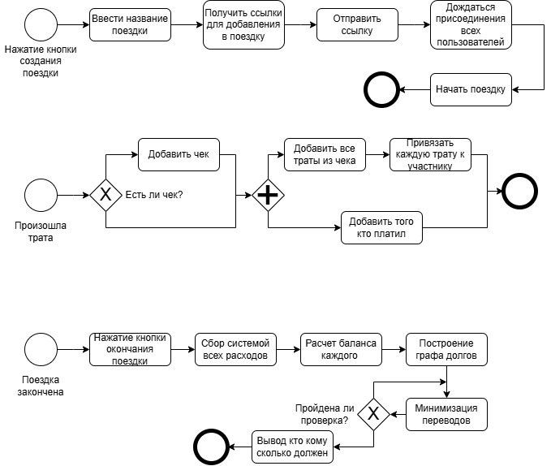

# TripSplit

## Идея проекта
TripSplit - веб-приложение для совместного учета расходов во время путешествий или других групповых мероприятий. Пользователи смогут создавать поездки, добавлять участников, фиксировать все траты, указывая, кому предназначалась покупка, а кто ее оплатил, проверять свои траты сохраняя фотографии чеков. В конце поездки система автоматически рассчитывает итоговые траты и формирует минимальное количество переводов между участниками, необходимое для полного погашения всех долгов. 

## Предметная область
Проект относится к приложениям помощникам для совместного управления личными расходами в группе людей. В реальной жизни, во время поездок или совместных мероприятий, люди часто оплачивают разные покупки друг за друга, будь то жилье, чек в ресторане или поездка на такси. Это приводит к сложным взаимным долгам, которые оказывается трудно подсчитать вручную - тут как раз и сможет помочь TripSplit.

## Аналогичные решения

| Решение   | Короткое описание                                                                 | Платформа           | Авторасчет долгов | Минимизация переводов | Офлайн режим |
|-----------|-----------------------------------------------------------------------------------|---------------------|-------------------|----------------------|-------------|
| [Splitwise](https://www.splitwise.com) | Онлайн-сервис для друзей, партнёров, коллег или соседей для отслеживания и подсчёта общих расходов | веб + приложение    | да                | частично             | ограниченно |
| [Tricount](https://tricount.com)  | Приложение для отслеживания групповых расходов и автоматического распределения между участниками | приложение          | да                | нет                  | да          |
| [Settle Up](https://settleup.io) | Приложение для учёта совместных расходов и взаимных долгов                      | веб + приложение    | да                | частично             | да          |
| [Splid](https://splid.app)     | Бесплатное мобильное приложение для отслеживания и справедливого разделения расходов в группах | приложение          | да                | нет                  | да          |

## Актуальность
Количество путешествующей и выезжающей на природу молодежи с каждым годом [растет](https://iz.ru/1910554/2025-06-27/rossianam-rasskazali-o-tratah-i-otdyhe-molodezi), однако бюджет на такие поездки, например, у неработающего студента, может быть не таким большим как бы хотелось. Поэтому, важно фиксировать все траты, чтобы по итогу не оставалось должников. Также, у населения [повышается](https://www.vedomosti.ru/press_releases/2025/07/01/finansovaya-gramotnost-v-rossii-pervie-rezultati-i-novie-vizovi-natsionalnoi-strategii) финансовая грамотность, поэтому, людям пригодится приложение, по которому можно следить, на что в определенной поездке были потрачены деньги. 

## Описание акторов
Пользователь - человек, не участвующий в данный момент в поездке.

Участник - человек, участвующий в поездке.

## Use-Case-диаграмма

## ER-диаграмма сущностей

## Пользовательские сценарии
Пользователь может создать новую поездку, дать ей название и пригласить туда других пользователей. В течение поездки, участники добавляют чеки, указывают привязанные к ним траты, при этом указывая что куплено, за какую сумму куплено и кому куплено, в подробностях, важных участникам (условно, можно добавить общую стоимость чека как одну трату и разделить между всеми, а можно учесть каждое блюдо и таким образом разделить стоимость максимально честно). В конце поездки, участники получают сообщение, сколько денег и кому они должны перевести. В любое время после поездки, пользователь может посмотреть анализ по предыдущим поездкам - его траты, траты других участников, обоснование распределения денежных переводов в конце поездки. 

## Формализация бизнес-процессов

